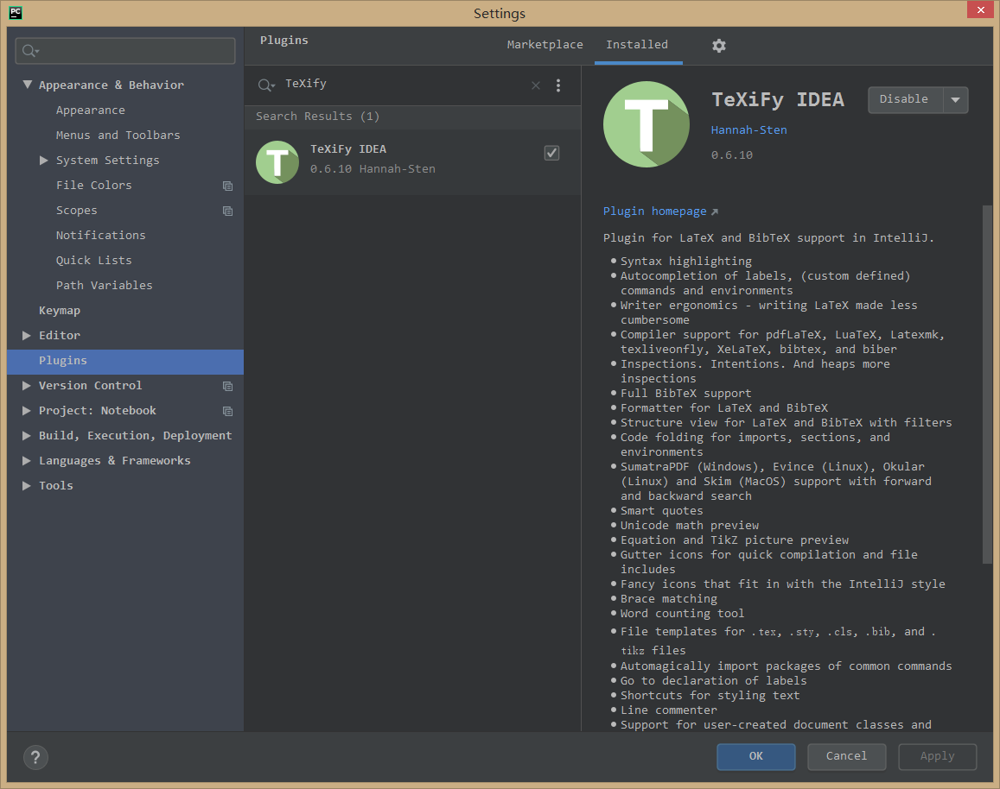
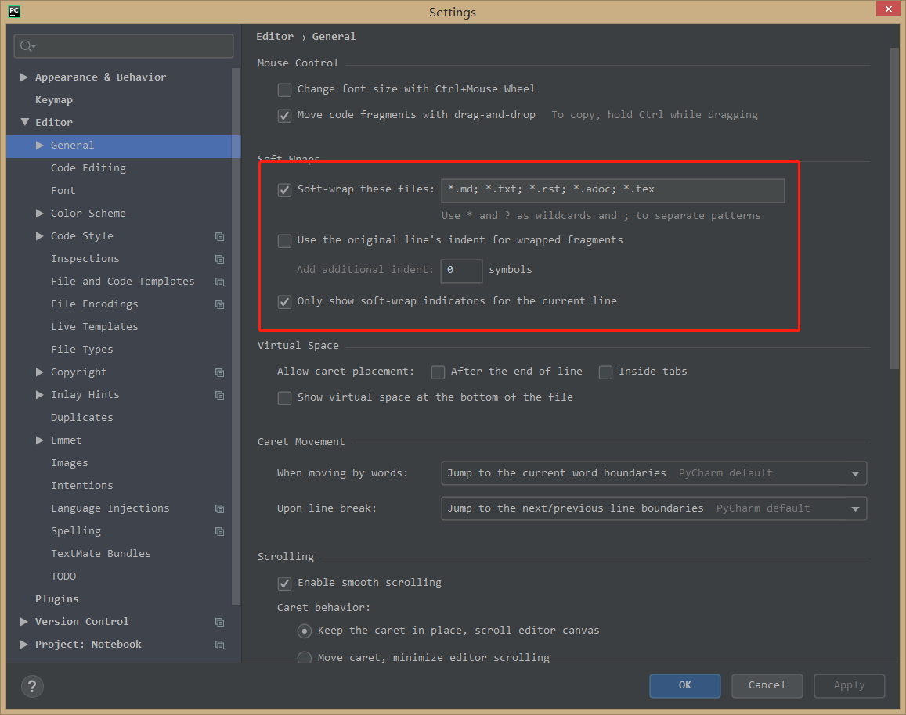
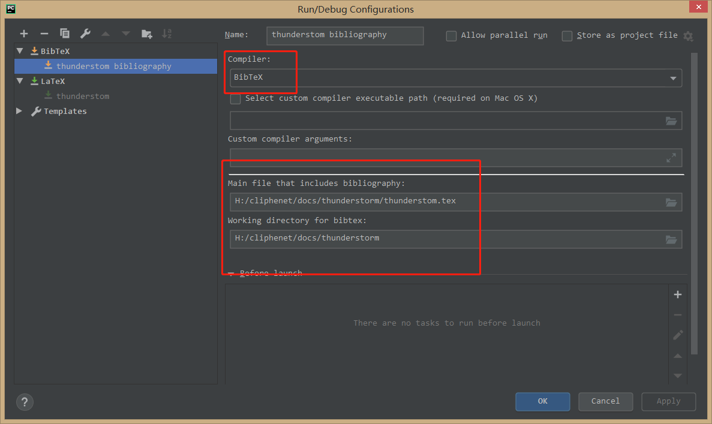
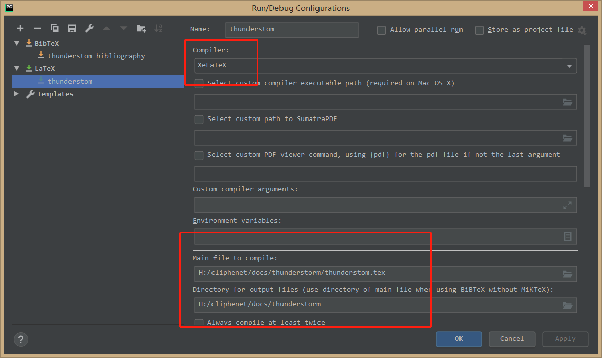

### 安装TeXiFy插件
打开Pycharm，依次点击`File-Settings-Plugins`，按照下图搜索安装即可，安装完成后重启Pycharm。

### 设置编写的脚本文件自动换行
在编写相应脚本时，会出现编写的很长的行的内容，Pycharm默认全部在一行显示，查看修改很不方便，可依次点击`File-Settings-Editor-General`，按照下图选中`Soft-wrap these files:`，并在框中加入`*.tex`，即可完成设置。

### 编译Latex引文时报错，无法正常引用
使用Pycharm编译Latex文档需要特别注意，应分别设置Bibtex和Latex两个编译器，如下图所示，选择文件对应的路径即可。

